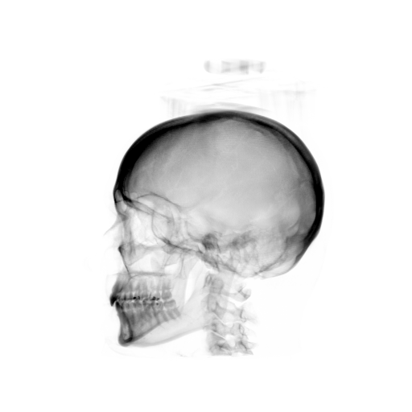
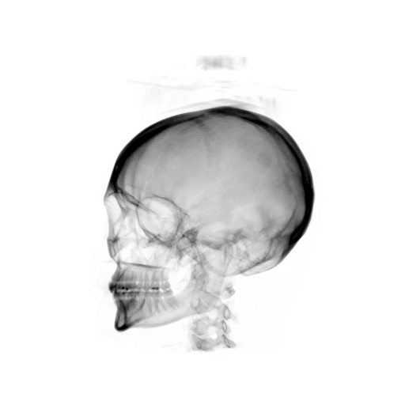
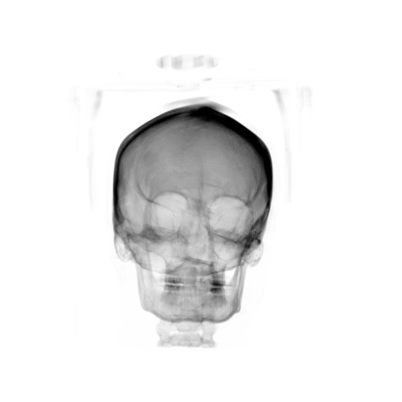
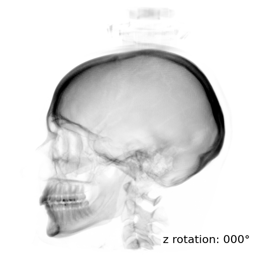
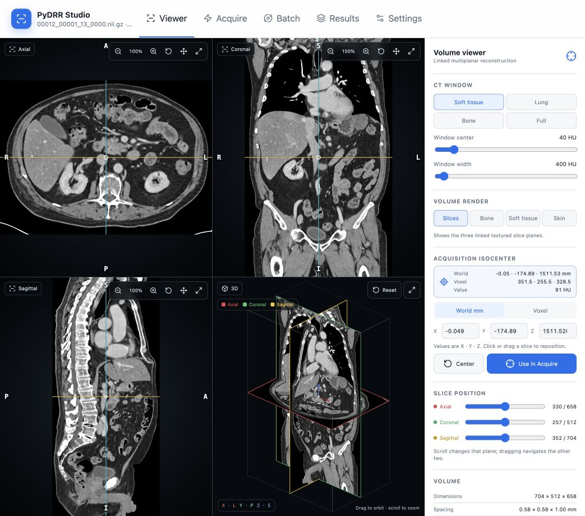

# PyDRR

PyDRR renders digitally reconstructed radiographs from CT and CBCT volumes
using a Siddon/Jacobs-style projector.

<p align="center">
  
  
  
  
</p>

## Install

Until the distribution is published on PyPI, install the current version
directly from GitHub:

```bash
python -m pip install "python-drr @ git+https://github.com/farrell236/python-drr.git"
```

This installs the Python API, command-line interface, CPU renderer, and the
accelerator runtime for the current platform: PyTorch for Apple Silicon MPS or
CuPy for CUDA on supported Linux and Windows systems. To include Studio:

```bash
python -m pip install "python-drr[studio] @ git+https://github.com/farrell236/python-drr.git"
```

From a cloned repository, install the local checkout instead:

```bash
python -m pip install .
```

The equivalent local installations are:

```bash
# Local Studio service and bundled web application
python -m pip install ".[studio]"

# Editable development installation
python -m pip install -e ".[studio,test]"
```

## Command line

Installation provides the `pydrr` command:

```bash
pydrr input.nii.gz \
  --projection-angle 45 \
  --orbit-tilt-x 20 \
  --orbit-tilt-y -10 \
  --detector-roll 5 \
  --projection-model relative-attenuation \
  --backend auto \
  --invert \
  --output projection.png
```

The explicit module form uses a chosen interpreter:

```bash
python -m pydrr --help
```

Available backends are `auto`, `cpu`, `cuda`, and `mps`. Automatic selection
prefers CUDA, then Apple Metal, then CPU. CPU multiprocessing uses
`--n-cores`.

The default `raw` projection model preserves the original qualitative CT-value
sum. `--projection-model relative-attenuation` maps calibrated CT values to
water-relative attenuation with `max(0, 1 + HU/1000)` before integration. This
model is energy independent and does not claim an absolute attenuation
coefficient.

## Python API

```python
from pydrr import generate_drr, load_volume_sitk, make_orbit_pose

volume = load_volume_sitk("input.nii.gz")
geometry = make_orbit_pose(
    iso_center_mm=[0.0, 0.0, 0.0],
    projection_angle_deg=45.0,
)
projection = generate_drr(volume, geometry, backend="auto")
```

See [`examples/single_projection.py`](examples/single_projection.py) for a
complete example.

## Geometry convention

PyDRR uses a patient-fixed orbit frame. Projection angle selects the source
position within that frame, X/Y tilts orient the orbit plane in physical world
coordinates, and detector roll rotates the panel around the central ray.
SimpleITK direction matrices are applied during world/voxel conversion and ray
tracing. Projection arrays follow image coordinates: row zero is the positive
detector V edge (the physical top), and column zero is the negative detector U
edge (the physical left).

The former `-rp` argument remains an alias for `--projection-angle`. Legacy
`-rx`, `-ry`, and `-rz` arguments retain their earlier acquisition-rotation
behavior and emit a deprecation warning.

## Studio

Install the Studio extra and start the local browser application:

```bash
python -m pip install "python-drr[studio] @ git+https://github.com/farrell236/python-drr.git"
pydrr-studio
```

<p align="center">
  
</p>

### Features

- **Local by default:** runs at `http://127.0.0.1:8765`; uploaded NIfTI volumes
  and generated results stay on the user's machine.
- **Linked 2 × 2 Viewer:** axial, coronal, and sagittal slices with physical
  orientation labels, synchronized crosshairs, HU sampling, CT windowing, and
  an orbitable 3D context.
- **Volume rendering:** Slices, Bone, Soft tissue, and Skin modes with
  independent intensity-shift and opacity controls.
- **Single acquisition:** AP, PA, and lateral presets; exact patient-fixed
  geometry; detector coverage checks; cancellable previews; and reusable saved
  views.
- **Batch acquisition:** configurable angle sweeps, 3D trajectory preview,
  shared normalization, optional Float32 arrays, progress, and cancellation.
- **Results and exports:** projection cine viewer, authoritative ZIP packages,
  JSON manifests, runnable shell scripts, and configurable GIF or H.264 MP4
  exports.
- **CPU and accelerator backends:** automatic or explicit CPU, NVIDIA CUDA, and
  Apple Silicon MPS selection using the environment that launched Studio.
- **Session recovery and settings:** restore an active local session after a
  refresh, choose the interface theme, and inspect the exact Python runtime and
  compute devices.

See the [Studio User Guide](docs/studio-user-guide.md) for the complete workflow
and the [Studio README](apps/studio/README.md) for development instructions.

## Repository layout

- `src/pydrr`: reusable rendering package and CLI
- `src/pydrr_studio`: optional local API and job service
- `apps/studio/frontend`: React/vtk.js frontend
- `tests`: core and Studio tests
- `examples`: small library examples
- `benchmarks`: backend benchmark tooling and historical results
- `docs`: architecture and documentation assets

## Acknowledgement

ChatGPT and Codex were used to assist with coding, debugging, and documentation.
