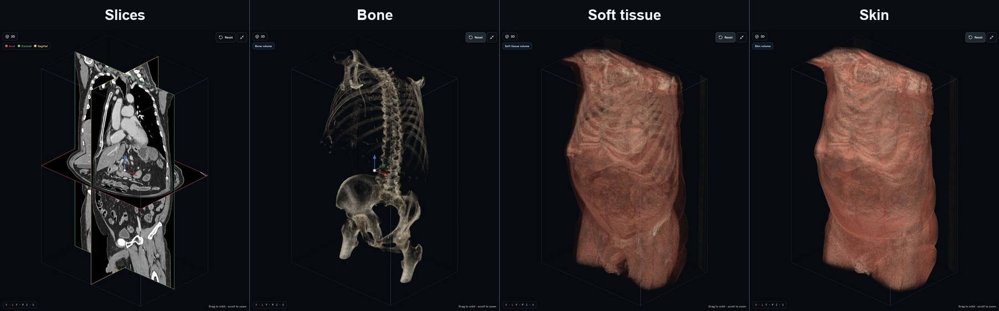
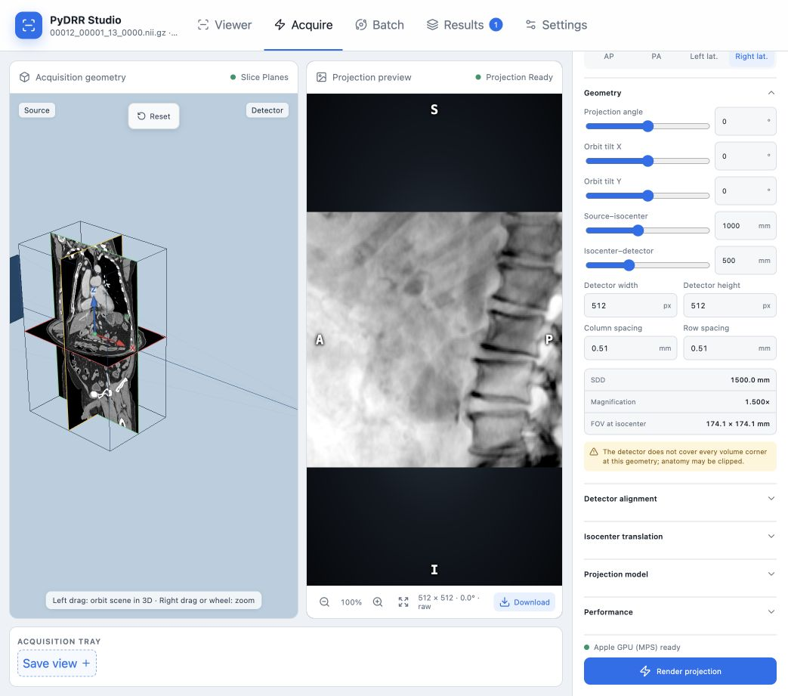
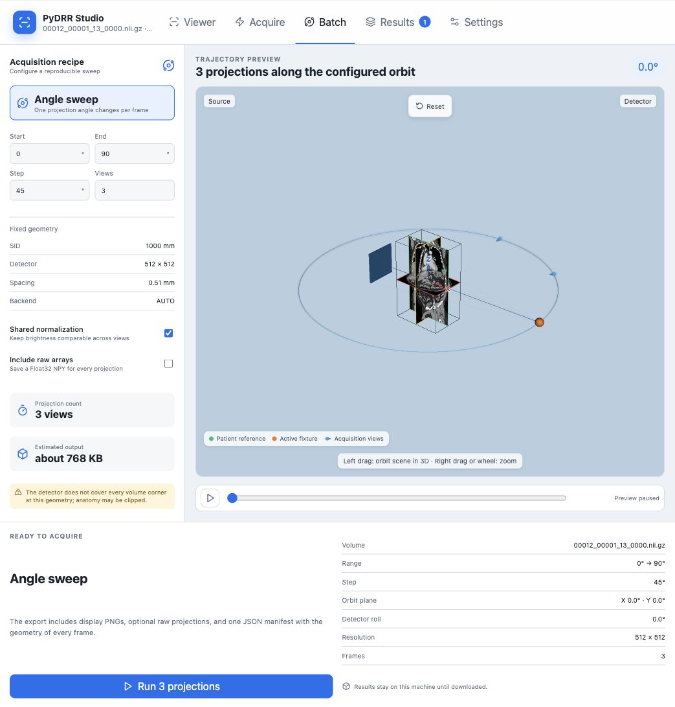
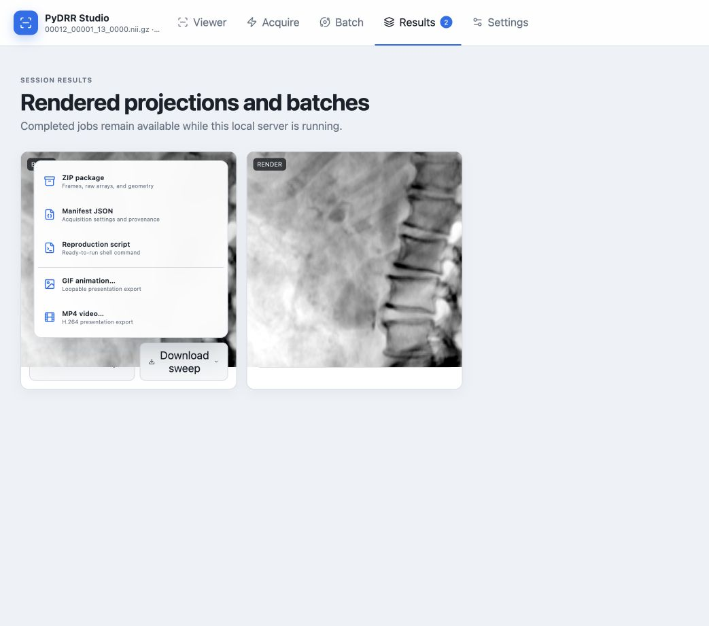
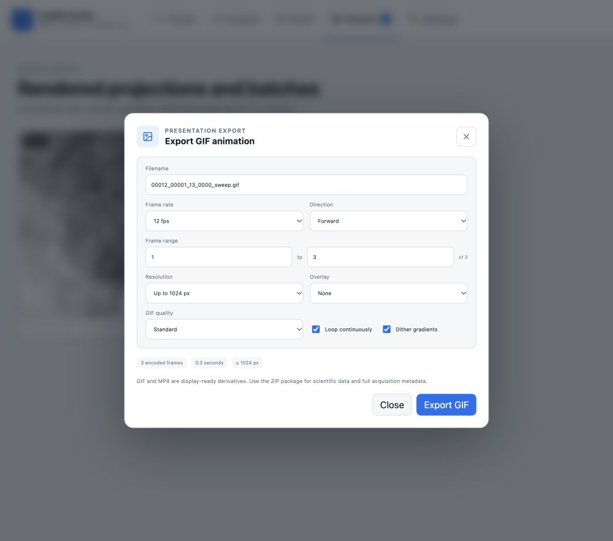
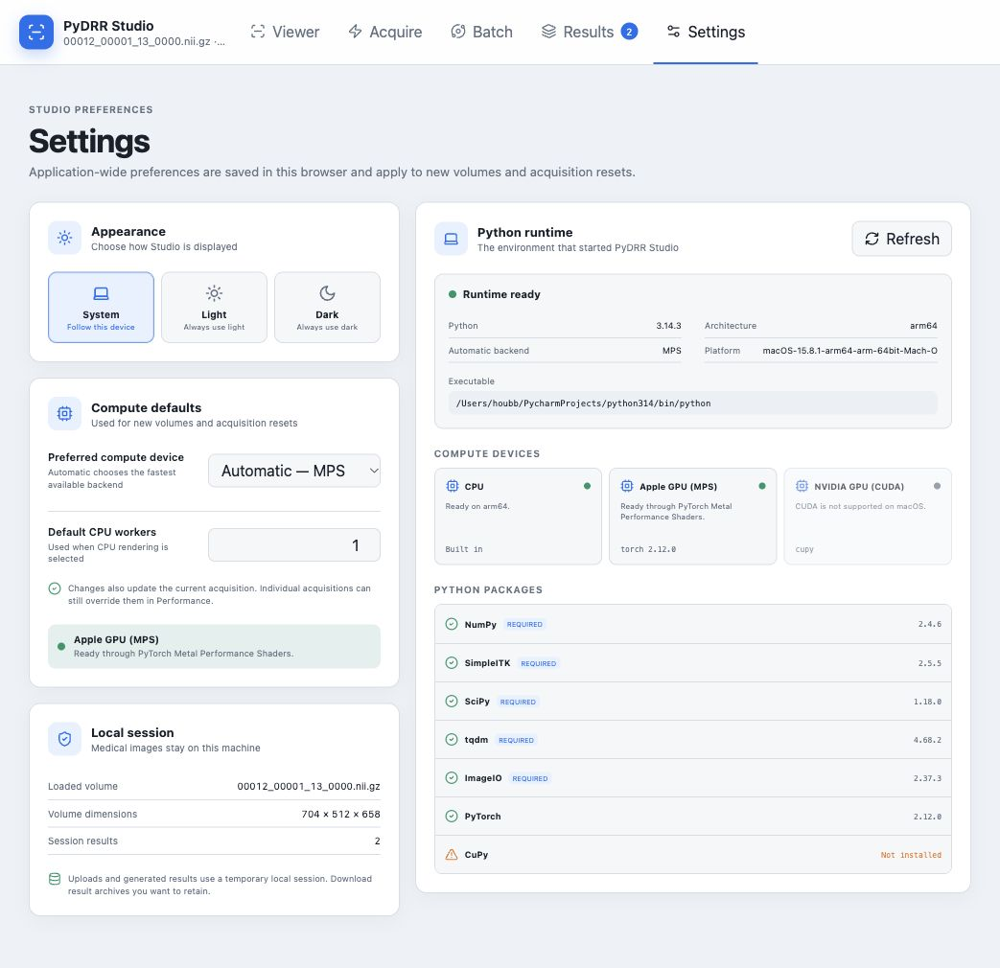

# PyDRR Studio User Guide

PyDRR Studio is the local browser interface for loading a CT or CBCT volume,
choosing an acquisition isocenter, rendering a single digitally reconstructed
radiograph (DRR), and acquiring an angle sweep. The web interface and the
renderer run on the same computer. Uploaded images are not sent to a hosted
service.

This guide covers the packaged Studio application. For the Python API and the
`pydrr` command, see the [project README](../README.md).

> [!NOTE]
> The figures in this guide were captured from a local Studio session using
> `00012_00001_13_0000.nii.gz`, the example CT volume selected for this
> documentation. Confirm that you are permitted to share any image-derived
> screenshots or exports before distributing them.

## Contents

- [Install and start Studio](#install-and-start-studio)
- [Quick start](#quick-start)
- [Load a volume](#load-a-volume)
- [Viewer](#viewer)
- [Acquire](#acquire)
- [Batch](#batch)
- [Results and exports](#results-and-exports)
- [Settings and compute devices](#settings-and-compute-devices)
- [Session recovery and data retention](#session-recovery-and-data-retention)
- [Command-line interoperability](#command-line-interoperability)
- [Troubleshooting](#troubleshooting)
- [Geometry glossary](#geometry-glossary)

## Install and start Studio

PyDRR requires Python 3.10 or newer. Until `python-drr` is published on PyPI,
install Studio directly from GitHub:

```bash
python -m pip install "python-drr[studio] @ git+https://github.com/farrell236/python-drr.git"
```

From a cloned repository, install the local checkout instead:

```bash
cd python-drr
python -m pip install ".[studio]"
```

Start the local application from the same Python environment:

```bash
pydrr-studio
```

Studio listens on `http://127.0.0.1:8765` and opens that address in the default
browser. Keep the terminal process running while using the application.

Useful launch options are:

```bash
# Start without opening a browser window
pydrr-studio --no-browser

# Use another port
pydrr-studio --port 9000

# Bind to a different address when you deliberately need to do so
pydrr-studio --host 127.0.0.1 --port 9000
```

The environment that launches `pydrr-studio` is also the environment used for
projection jobs. Studio does not select a second Python interpreter or install
packages at runtime.

### Installation choices

| Installation | Includes |
| --- | --- |
| `python-drr` | Python API, `pydrr` CLI, CPU renderer, and the platform accelerator dependency |
| `python-drr[studio]` | Everything above plus the local server, packaged web interface, and media-export dependencies |

On Apple Silicon, the core installation includes PyTorch for Metal Performance
Shaders (MPS). Supported NVIDIA Linux and Windows installations use CuPy for
CUDA. CPU rendering is always available.

## Quick start

1. Run `pydrr-studio` and open the local address shown in the terminal.
2. Drop a `.nii` or `.nii.gz` file on the landing page, or choose **Select
   volume**.
3. In **Viewer**, inspect the three slice planes and position the crosshair at
   the required acquisition isocenter.
4. Choose **Use in Acquire** or open **Acquire** from the navigation bar.
5. Select an anatomical preset or enter the geometry, detector, projection,
   and compute settings.
6. Choose **Render projection** and inspect the preview.
7. For multiple angles, open **Batch**, enter the angle range and step, and
   choose **Run projections**.
8. Open **Results** or use **Download sweep** to retain the output.

The navigation bar shows the loaded volume and its dimensions. Its Results
badge is the number of jobs retained in the current local session.

## Load a volume

The landing page accepts NIfTI files ending in `.nii` or `.nii.gz`. A selected
file is uploaded to the loopback Studio service, inspected with SimpleITK, and
stored in a temporary local session.

The file must contain a readable three-dimensional image. Studio records its
dimensions, voxel spacing, physical origin, direction matrix, intensity range,
and physical center. A progress state is shown while a large compressed volume
is being transferred and opened.

After loading succeeds, Studio opens **Viewer**. If physical spacing is invalid
or the direction matrix is singular or non-orthonormal, the image remains
viewable, but Acquire and Batch are disabled. This prevents a projection from
silently using incorrect physical geometry.

## Viewer

Viewer combines axial, coronal, and sagittal multiplanar reconstruction (MPR)
with an orbitable 3D context. The four panes remain a 2 × 2 grid on narrow
screens.


*Figure 1. The real CT volume in the linked MPR Viewer. The acquisition
isocenter is shared by the three crosshairs and the 3D axis marker.*

### Navigate the slice views

Each slice pane shows physical orientation labels at its edges. These labels
come from the image direction matrix; they should be used instead of assuming
that the top of every stored image has the same anatomical direction.

| Action | Result |
| --- | --- |
| Scroll over a pane | Moves through slices perpendicular to that pane |
| Click a point | Moves the shared crosshair to that physical location |
| Drag with the crosshair tool | Scrolls the other two views while the dragged image remains fixed |
| `Ctrl`/`Command` + scroll | Zooms around the pointer |
| **−** / **+** | Zooms the active pane |
| **Fit image** | Restores the default zoom and pan |
| **Pan** | Toggles click-drag panning for that pane |
| **Maximize** | Temporarily expands one pane; choose Restore to return to 2 × 2 |

The colored crosshair is the acquisition isocenter. Moving it in any view
updates the other slices, the 3D view, the world and voxel readouts, and the
translation later used in Acquire.

### Set the CT window

The **CT window** controls affect the three slice images and the slice-plane
textures shown in 3D. Presets provide common starting points:

- **Soft tissue:** center 40 HU, width 400 HU
- **Lung:** center −600 HU, width 1500 HU
- **Bone:** center 500 HU, width 2000 HU
- **Full:** spans the intensity range of the loaded image

Use **Window center** to move the displayed intensity range and **Window
width** to widen or narrow it. These display controls do not alter the source
volume used by the projector.

### Choose the 3D representation

The **Volume render** section controls both the Viewer 3D pane and the patient
representation carried into the Acquire and Batch geometry scenes.

| Mode | Purpose |
| --- | --- |
| **Slices** | Shows the three current textured slice planes |
| **Bone** | Emphasizes high-intensity structures |
| **Soft tissue** | Uses a soft-tissue transfer-function preset |
| **Skin** | Emphasizes the outer volume surface |



*Figure 2. The four 3D modes rendered from the same CT volume, isocenter, and
default camera. Only the rendering mode changes between panels.*

Bone, Soft tissue, and Skin each remember their own **Intensity shift** and
**Opacity** values. Intensity shift moves that preset's transfer function along
the HU scale; opacity changes its overall visibility. **Reset preset** restores
the selected preset without changing the source volume or CT window.

Use the mouse or pointer to orbit the 3D camera, the wheel to zoom, and the
view toolbar to reset or maximize the pane. The crosshair axes at the
isocenter identify physical X, Y, and Z.

### Enter an exact isocenter

The **Acquisition isocenter** section reports:

- **World:** physical X, Y, Z in millimetres.
- **Voxel:** continuous X, Y, Z image indices.
- **Value:** the sampled intensity at the current crosshair in HU.

Choose **World mm** or **Voxel**, edit X, Y, and Z, then press Enter or leave
the field to apply the values. **Center** returns to the physical center of the
volume. **Use in Acquire** opens Acquire with the corresponding fixed-world
translation.

The separate **Slice position** sliders offer precise axial, coronal, and
sagittal navigation. **Volume** below them reports dimensions, spacing, and
the loaded intensity range.

## Acquire

Acquire configures one projection. Its left sidebar contains the exact values
saved with the result, the center scene provides a geometric preview, and the
right pane displays the rendered DRR.



*Figure 3. A completed 512 × 512 projection. The central scene shows the
patient-fixed geometry; the preview retains the settings that produced it.*

### Start from an anatomical preset

The AP, PA, Left lateral, and Right lateral buttons set a standard projection
angle and clear both orbit tilts and detector roll. They are convenient
starting points, and every resulting value remains editable.

| Preset | Projection angle |
| --- | ---: |
| AP | −90° |
| PA | 90° |
| Left lateral | 180° |
| Right lateral | 0° |

### Configure the geometry

The geometry follows a patient-fixed orbit convention:

- **Projection angle** moves the source and detector around the current orbit
  plane.
- **Orbit tilt X** rotates the orbit plane about the fixed physical world X
  axis.
- **Orbit tilt Y** rotates it about the fixed physical world Y axis.
- **Detector roll** rotates the panel in its own plane around the central ray.

The controls are independent; changing one angle does not reinterpret another
as rotation about a moving patient or detector axis.

**Source–isocenter** is the source-to-isocenter distance (SID), and
**Isocenter–detector** is the isocenter-to-detector distance (IDD). Studio
reports the derived source-to-detector distance (SDD), magnification, and field
of view at isocenter:

```text
SDD = SID + IDD
magnification = SDD / SID
FOV at isocenter = detector physical size / magnification
```

Detector width and height are pixel counts. Column and row spacing define the
physical pixel pitch in millimetres. A larger pixel count or larger spacing
increases detector coverage; increasing resolution also increases run time and
memory use.

Open **Detector alignment** to set detector roll and U/V offsets. U and V are
the detector's local horizontal and vertical axes. Open **Isocenter
translation** to enter the same fixed-world X/Y/Z offset controlled by the
Viewer crosshair.

Studio warns when the source is inside the volume or when the detector is
likely to clip the projected volume. A clipping warning is advisory; a source
placement or invalid physical-geometry error blocks acquisition.

### Inspect and save a view

The acquisition scene shows the source, detector, central ray, patient
representation, detector outline, orbit, and isocenter coordinate axes.
Drag to orbit the inspection camera and use the wheel or secondary-button drag
to zoom. These camera actions do not change the acquisition geometry. The
circular-arrow button restores the default inspection view.

**Save view +** adds the current acquisition settings to the Acquisition tray.
Selecting a saved view restores it. Press and hold a saved view, then drag it
to reorder the tray; the other items move to show the insertion position.
While dragging, **Save view +** becomes the red deletion target. Drop the item
there to delete it. The active view has a colored halo.

The share button beside Reset downloads the current configuration as a
ready-to-run `.sh` script.

### Choose a projection model

| Model | Behavior |
| --- | --- |
| **Raw CT sum — qualitative** | Integrates the thresholded source values along each ray. It preserves the original qualitative PyDRR behavior. |
| **HU-relative attenuation** | Maps every voxel to `max(0, 1 + HU/1000)` before integration. Water is 1 and air is approximately 0. This is a relative, energy-independent model. |

**Air threshold** ignores values below the chosen level. **Clamp negative
values** treats remaining negative values as zero. **Invert display** produces
dark anatomy on a light background in display-oriented output. **Low
percentile** and **High percentile** define the normalization range for the
preview and PNG output.

The HU-relative model does not simulate an X-ray energy spectrum and does not
produce an absolute attenuation coefficient.

### Choose a compute device

Under **Performance**, choose:

- **Automatic:** CUDA when available, then Apple MPS, then CPU.
- **CPU:** always available. The CPU worker count appears when CPU is active.
- **Apple GPU (MPS):** available on a compatible Apple Silicon PyTorch runtime.
- **NVIDIA GPU (CUDA):** available when a compatible CUDA/CuPy runtime is
  detected.

Unavailable devices remain visible but cannot be selected. The runtime card
shows the exact Python executable, device status, and installed accelerator
package. Individual acquisition settings override the defaults chosen in
Settings.

### Render and inspect the projection

Choose **Render projection** to start a local worker. The button changes to
**Cancel render** while the job is running. The preview reports progress and
then displays the DRR with physical detector orientation labels.

Use the preview toolbar to zoom, fit, and download the result. Scroll zooms
around the pointer and click-drag pans the image. If a control changes after a
render, the preview is marked **Settings changed — render to update**. The old
preview and its original provenance remain intact until another render
finishes.

Numeric fields may be cleared while editing. If a required field is still
blank when Render is chosen, Studio identifies the blank field instead of
silently substituting zero.

## Batch

Batch acquires a sequence by changing only the projection angle. All other
geometry, detector, model, backend, isocenter, and display choices are inherited
from Acquire.



*Figure 4. A three-view 0° to 90° sweep. Diamond markers show the acquisition
positions and point toward isocenter.*

### Define the sweep

Enter **Start**, **End**, and a positive **Step** in degrees. End must be
greater than or equal to Start. Studio calculates the inclusive number of
views as:

```text
views = floor((end - start) / step) + 1
```

The final generated angle therefore does not exceed End; it equals End only
when the range is divisible by Step. One sweep may contain at most 720 views.

The fixed-geometry summary shows SID, detector size, pixel spacing, and
backend. To change those values, return to Acquire.

### Choose batch output options

- **Shared normalization** uses one display range across the sweep, keeping
  frame brightness comparable. Disable it when each view should use its own
  display normalization.
- **Include raw arrays** stores one Float32 `.npy` array for each projection in
  the ZIP package. It increases output size substantially.

The sidebar estimates the projection count and output size before the run.

### Preview and run the trajectory

The patient remains fixed while the complete acquisition fixture follows the
configured 3D orbit. Diamond markers indicate snapshot positions. Dragging the
scene changes only the inspection camera; it does not change projection angle,
orbit tilt, or detector roll.

The trajectory is paused by default. Move the angle slider to inspect a
position, or choose Play to animate the preview. The orbit ring, source,
detector, and central ray remain part of one fixture. During an acquisition,
the scene follows the current frame.

Choose **Run projections** to begin. Progress and the active angle are shown
while the local worker runs; choose **Cancel batch** to stop it. A completed
batch exposes **Download sweep** in Batch and creates a result card.

## Results and exports

Results contains the completed single renders and batches for the current
local server session. Each card records its creation time, status, and job
summary.



*Figure 5. Results from the example CT. Every completed batch exposes the same
Download sweep menu in Batch and Results.*

### Inspect a completed sweep

Choose **View sweep** on a batch card to open the cine viewer. It supports:

- Play and pause.
- Previous and next frame.
- Direct frame scrubbing.
- Frame number and projection-angle readout.
- Pointer-centered zoom, panning, and Fit.

The viewer uses the stored PNG frames. Use the ZIP package or raw arrays for
scientific processing.

### Download sweep formats

| Menu item | Contents and use |
| --- | --- |
| **ZIP package** | Authoritative batch package containing PNG frames, optional Float32 arrays, and the geometry manifest |
| **Manifest JSON** | Acquisition settings, per-frame angles and geometry, package version, input provenance, and output information |
| **Reproduction script** | A ready-to-run shell script that calls the installed `pydrr` CLI for each view |
| **GIF animation** | Loopable, display-oriented animation with configurable presentation settings |
| **MP4 video** | H.264, display-oriented video with configurable presentation settings |

The ZIP package remains the authoritative output. GIF and MP4 apply display
normalization and may be resized or annotated.

### Configure GIF and MP4 exports



*Figure 6. Presentation export settings for the completed three-frame CT
sweep.*

Both media dialogs provide:

- A filename.
- Frame rates of 6, 12, 24, 30, or 60 fps.
- Forward, Reverse, or Ping-pong playback.
- A one-based inclusive frame range.
- Original resolution, up to 1024 px, or up to 512 px.
- No overlay, Projection angle, or Angle and frame overlays.

GIF additionally offers looping, quality, and dithering controls. MP4 offers
video quality. The dialog reports the encoded frame count and expected
duration before export. Ping-pong does not duplicate the first and last frames
at the turnarounds.

Media encoding runs as a cancellable local background job. Reopening the same
format dialog restores its most recent settings and reconnects to an active or
completed export while the server session still exists.

### Result provenance

Downloaded manifests record enough context to identify how a result was made,
including:

- `python-drr` and Studio versions.
- Creation timestamp.
- Input filename, byte size, and SHA-256 checksum.
- Image dimensions and physical metadata.
- Isocenter, orbit, detector, projection-model, normalization, and backend
  settings.
- The angle and geometry for each batch frame.

Keep the manifest with derived images. The browser screenshot or presentation
video alone is not a complete acquisition record.

## Settings and compute devices

Settings stores application-wide preferences in the current browser. These
preferences apply to newly loaded volumes and acquisition resets; the
Performance section in Acquire can still override them for one acquisition.



*Figure 7. Settings from the documented Apple Silicon session. Studio reports
the exact interpreter and package versions used by render workers.*

### Appearance

- **System** follows the device appearance.
- **Light** always uses the light theme.
- **Dark** always uses the dark theme.

### Compute defaults

Choose the preferred compute device and, when CPU is selected, the default
worker count. The status card explains whether the selected accelerator is
ready.

### Local session

This card identifies the loaded filename, volume dimensions, and current
result count. It is also a reminder that uploads and generated results are
temporary until downloaded.

### Python runtime

The runtime panel reports:

- Python version, architecture, platform, and executable path.
- The backend selected by Automatic.
- CPU, MPS, and CUDA availability with the reason for unavailable devices.
- Versions of required packages and optional accelerator packages.

Choose **Refresh** after changing the environment outside Studio. A running
server continues to use the interpreter and packages with which it was
started; restart it after installing or replacing packages.

## Session recovery and data retention

Studio keeps one temporary active session in server memory and its local
temporary directory. Browser preferences are stored separately in the browser.

When the page refreshes or the browser returns to the same running server,
Studio detects the active session and asks **Restore previous session?**:

- **Restore** returns to the prior workspace with its volume, Viewer and
  acquisition controls, saved views, active-job monitoring, and results.
- **Start new** deletes the old temporary session and opens the landing page.

When no session exists, Studio opens the landing page directly. Stopping or
restarting `pydrr-studio` clears the temporary session, so download all results
that must be retained before ending the server process.

The default server binds only to the loopback interface. If `--host` is changed
to expose Studio on a network, access control and network policy become the
operator's responsibility.

## Command-line interoperability

Installing Studio also installs the `pydrr` command. A single acquisition can
be reproduced without the browser:

```bash
pydrr input.nii.gz \
  --projection-angle 45 \
  --orbit-tilt-x 20 \
  --orbit-tilt-y -10 \
  --detector-roll 5 \
  -scd 1000 \
  --idd 1000 \
  -size 512 512 \
  -res 0.51 0.51 \
  --projection-model relative-attenuation \
  --backend auto \
  --invert \
  --output projection.png
```

`--projection-angle` selects the source position in the configured orbit
plane. The older `-rp` spelling is retained as an alias.

The shell-script buttons in Acquire and the Batch download menu write the
current interface settings as runnable `pydrr` commands. A downloaded batch
script uses the `pydrr` available on `PATH`; set its documented `PYTHON_BIN`
override when it must run through a particular environment.

## Troubleshooting

| Symptom | What to check |
| --- | --- |
| The browser cannot reach Studio | Confirm that the `pydrr-studio` terminal process is still running and open the exact host and port printed there. |
| A `.nii.gz` file is greyed out in the file chooser | Confirm that the filename ends in `.nii` or `.nii.gz`. On macOS, choose **Show Options** if the dialog is applying an unrelated file-type filter. |
| Upload fails | Confirm that SimpleITK can read the file and that it contains a 3D image. Check the terminal for the server-side error. |
| Viewer works but Acquire is disabled | Inspect the orientation warning. Physical spacing must be positive, and the direction matrix must be finite, orthonormal, and non-singular. |
| The detector may clip the volume | Increase detector width/height or physical pixel spacing, reduce magnification, or reposition the isocenter. Review the reported FOV at isocenter. |
| Render reports that a value is blank | Complete every highlighted numeric field. Studio deliberately does not replace an empty field with zero. |
| CUDA or MPS cannot be selected | Open Settings and inspect the device explanation and package versions. Run Studio from the Python environment containing the platform accelerator dependency. |
| Automatic chose an unwanted device | Select CPU, MPS, or CUDA explicitly under Acquire > Performance or change the default in Settings. |
| A large projection is slow or runs out of memory | Reduce detector width and height while positioning the geometry, then render the required final resolution. CPU run time and raw-array batch size grow with pixel and frame counts. |
| Batch cannot start | Check that End is at least Start, Step is positive, the calculated count is 1–720, all fields are complete, and the inherited Acquire geometry is valid. |
| Adjacent batch frames have different brightness | Enable Shared normalization before running the batch. |
| A presentation export is unavailable | Complete a batch first. Keep the server running while the GIF or MP4 background job finishes. |
| Results disappeared after restart | Results belong to the temporary server session. Retain them by downloading the ZIP, manifest, script, or presentation export before shutdown. |
| Anatomy appears oriented unexpectedly | Read the physical orientation letters in the slice or projection view. PyDRR applies the image direction matrix rather than assuming storage order is anatomical order. |

## Geometry glossary

| Term | Meaning in PyDRR Studio |
| --- | --- |
| **Isocenter** | Physical point about which the acquisition orbit is constructed |
| **Projection angle** | Source position angle inside the configured patient-fixed orbit plane |
| **Orbit tilt X/Y** | Rotations of the orbit plane about fixed physical world X and Y axes |
| **Detector roll** | In-plane detector rotation about the source-to-detector central ray |
| **SID** | Source-to-isocenter distance |
| **IDD** | Isocenter-to-detector distance |
| **SDD** | Source-to-detector distance, equal to SID + IDD |
| **U/V** | Detector-local horizontal and vertical axes |
| **Detector spacing** | Physical row and column pixel pitch in millimetres |
| **FOV at isocenter** | Detector physical coverage mapped back to the isocenter plane |
| **World coordinates** | Physical X/Y/Z coordinates in millimetres after origin, spacing, and direction are applied |
| **Voxel coordinates** | Continuous image X/Y/Z indices |
| **DRR** | Digitally reconstructed radiograph produced by integrating volume values along source-to-detector rays |
